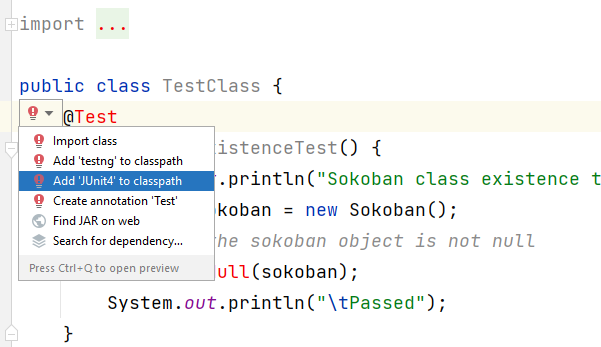
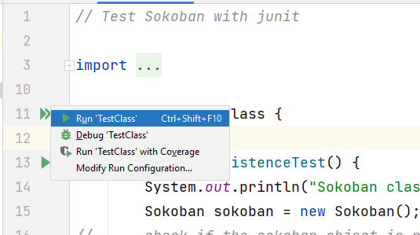
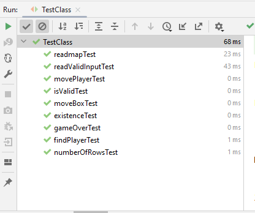
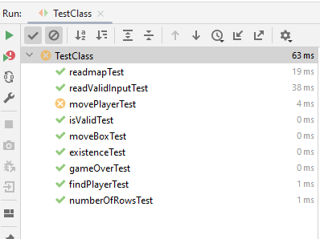

# COMP2026/COMP2045 Programming Assignment 1 - Sokoban 

## 2023-24 Semester 1

* Designed by: [Dr. Kevin Wang](mailto:kevinw@comp.hkbu.edu.hk)
* Q & A: [Discord](https://discordapp.com/channels/1004554070083776672/1004554070083776678)
* Assignment Website: [GitHub](https://github.com/khwang0/COMP2045-2324PA1)
* Due: 
  * UAT Due: 23:59pm TBD (Monday midnight)
  * Programming Due: 23:59pm TBD (Thursday midnight)
* Download the starter code: [Sokoban](Sokoban.java) 
* Download the demo program: [here](demo.jar)
* Download everything from the assignment: [here](https://github.com/khwang0/COMP2045-2324PA1/archive/refs/heads/master.zip)

> To run the demo program, type the following in your terminal:
> 
> ```sh
> > java -jar demo.jar
> ```


<sub><sup>

image ref: [Carloseow at English Wikipedia](https://en.wikipedia.org/wiki/Sokoban#/media/File:Sokoban_ani.gif) 

</sup></sub>

# Learning outcome

Students are expected to have some practice on arrays/2D arrays/parameter passing/method construction and usage in this assignment. We expect most students would spend six hours or more to finish the assignment without any assistance. Make sure you start earlier as possible and ask us on Discord if you have any difficulty! Note: we want to familiarize arrays and 2D arrays, so you are not supposed (and not allowed) to use advanced data structures like ArrayList, Set, Map, etc...


# Introduction

You are going to complete the Sokoban program! Open [Sokoban.java](Sokoban.java) and complete the methods stated in the skeleton code. Some of these methods are very straightforward while some of them ain't that easy. Make sure you can follow the instructions given at the top of each method.

A [sample program](demo.jar) is given to you. When there is something you are not sure, you can take a look at the sample program to decide what to do. There is [another sample programe](demo_without_fixmap.jar) that would support you to deduce the function of the method `fixmap`.

Some methods are labeled as completed or given. Please don't make any change on those methods. You are not supposed to modify them. **You can add your own method if you want to**.

## Explanation of the game Sokoban


You can skip this section if you have some experience in playing the game Sokoban. It is a role play game where a player tries to push boxes to the target locations. The player can only push the box but not pull it. The player can only push one box at a time. The player can only move to an empty space or a target location. The player cannot move to a wall or a box. The player wins the game when all target locations have a box on it. The player loses the game when he/she is stuck and cannot move any more.

## Explanation about the assignment

You are given the skeleton code. Complete all methods in the assignment with respect to the instructions stated in the Java file.


## `TestClass` class

You don't need to do anything with this java file. The purpose of this file is to conduct some *unit test* for your code. If you are using IntelliJ, you should be able to use this file within a few quick steps. By looking at this file, you should have some ideas of how the TA grade your work!

1. Open the file `TestClass.java`
2. Click on the word `@Test` at line 31.
   ](img/add-JUnit.png)
3. Click the red bulb and select `Add JUnit-5.x.x to classpath`.
   
4. Click the arrow on the left of `public class TestClass` at line 17 and select `Run Tests`.

1. You shall see the following screen if there isn't any problem
  
1. Or you will see some error if your code does not perform what it is suppose to do. For example in the figure below, the test case `testReadValidInput` is not working properly.
 

> Note: If you are struggle with this file (e.g. cannot compile your code), simply delete this file. 

# Understanding the Assignment Test (UAT)

This part is independent to your programming code. You will need to answer the following short questions by **another due date**.
Submit your answers on Moodle. 

1. Which method is responsible to print the game board?
2. Which method is responsible to decide if the game ends?
3. Can a player push two boxes at a time?
4. What key should I press if I decide to restart the game?
5. What does the method `fixmap` do?

---


# Submission 
For submission upload the file `Connect4.java` to GitHub classroom.  

Please be reminded that both the **Late Penalty Rule** and the **Penalty for Plagiarism** are applied strictly to all submissions of this course (including this assignment).   

### Late Penalty Rule

```java
if (lateHour > 0) {
    if (lateHour < 24) 
        mark *= 0.8;
    else if (lateHour < 48)
        mark = mark >> 1;
        else if (lateHour < 72)
            mark = mark >> 2;
            else
                mark &= 0;
}
```


 ## Plagiarism

 Plagiarism is a serious offense and can be easily detected. Please don't share your code to your classmate even if they are threatening you with your friendship. If they don't have the ability to work on something that can compile, they would not be able to change your code to a state that we can't detect the act of plagiarism. For the first commit of plagiarism, regardless you shared your code or copied code from others, you will receive 0 with an addition of 5-mark penalty. If you commit plagiarism twice, your case will be presented in the exam board and you will receive a F directly.


> # Terms about generative AI
> You are not allowed to use any generative AI in this assignment.
> The reason is straight forward. If you use generative AI, you are
> unable to practice your coding skills. We would like you to get
> familiar with the syntax and the logic of the Java programming.
> We will examine your code using detection software as well as 
> inspecting your code with our eyes. Using generative AI tool 
> may fail your assignment.

## Marking Scheme 
This assignment is worth X% of the course mark.  There are three elements in the marking scheme: 
* 5% - Understanding the Assignment Test (UAT)
* 10% - the program can be compiled without any error
* 75% - a working program that functions as specified 
* 10% - completion of the `runApp` method.
* -50% - if you define any class variable (field), addition class, or change the method `main`.
* -30% - if you use any advanced data structure such as `java.util.List`, `java.util.ArrayList`, `java.util.Arrays`, `java.util.Set`, `java.util.Map` etc to replace your primitive array.

Please note that submitting a program that cannot be compiled would result in a very low mark. 

For the correctness of your program, we will test your program with a set of test cases.  The test cases will be similar to the sample program.  All test cases will be released after the submission deadline.  
 

## Interview 
Should the teaching team see fit, students may be requested to attend an interview to explain about their program.  Students failing to attend such interview or to demonstrate a good understanding of their own program may result in mark deduction. 


